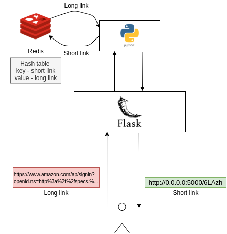

### Flask TinyURL Service
#### Run your own URL shrinking service such as bit.ly or goo.gl.

#### Project Documentation
* [Project documnetation](./documentation/documentation.md)   

#### Architecture
   


[Project implementation plan](./documentation/develop-plan.md)   
[Log work](./documentationlog-hours.md)   

* Original Estimate - **16h**
* Log work - **14h 30m**
* Remaining Estimate - **0m**

#### Installation 

```
# clone app
git clone https://github.com/BondaiKa/tinyurl.git

# change your working dir to project's path
cd project/path
```

* Install docker [Docker](https://docs.docker.com/)   

#### environment variables 

* rename `.env_example` to `env`

#### Running docker containers :whale:

* To run container:

```bash
docker-compose up --build
```